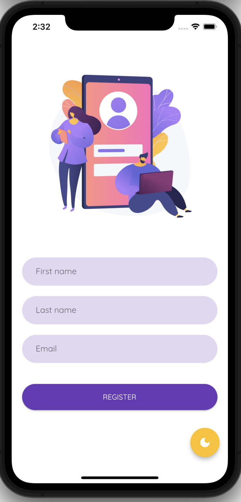

# Login UI

Flutter app used ot practice registration flow.

 

## APK Link

Here is a link to the built APK

[Login UI APK](https://drive.google.com/file/d/1QgKiYs4CO4abth8W2m_jFD9di6jkNC9H/view?usp=sharing)

### Dependencies

1. [GetX](https://pub.dev/packages/get)
1. [Get Storage](https://pub.dev/packages/get_storage)
1. [Lottie](https://pub.dev/packages/lottie)
1. [Google Fonts](https://pub.dev/packages/google_fonts)
1. [Flutter Launcher Icons](https://pub.dev/packages/flutter_launcher_icons)
1. [Flutter Native Splash](https://pub.dev/packages/flutter_native_splash)

# Me?

[Behon Baker](https://behon.baker.com)
